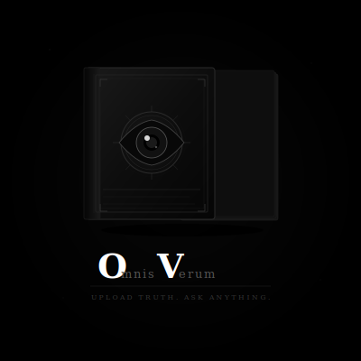

# OmnisVerum
A crowd-sourced, trust-weighted, near-omniscient knowledge platform.
## What is Omnisverum?
A crowd-sourced, trust-weighted, near-omniscient 
knowledge platform where anyone can upload 
information and an AI answers questions based 
on everything uploaded.

## Features
- Create and join servers
- Anonymous or named posting
- AI-powered semantic search
- Reputation system
- Bounty system
- Personal and server blacklists
- Public server with reputation gating

## Status
🚧 In development
